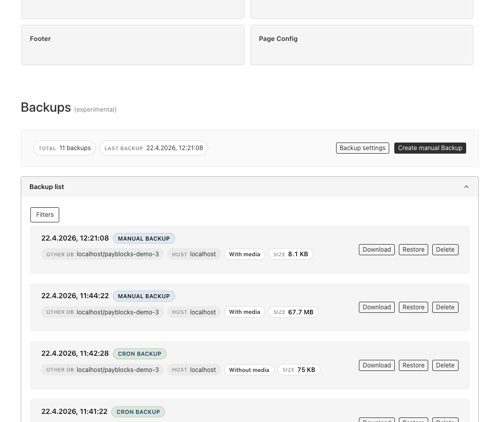
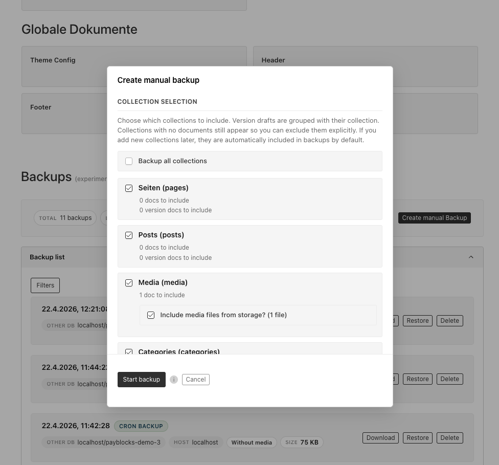
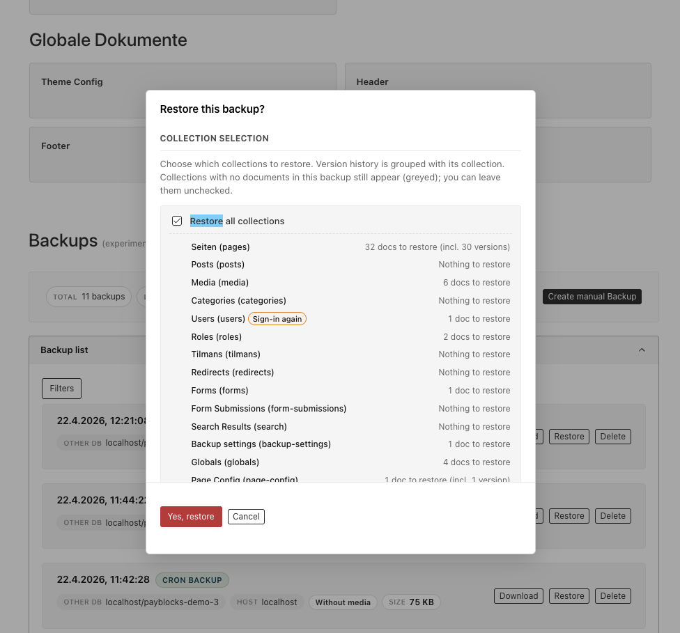
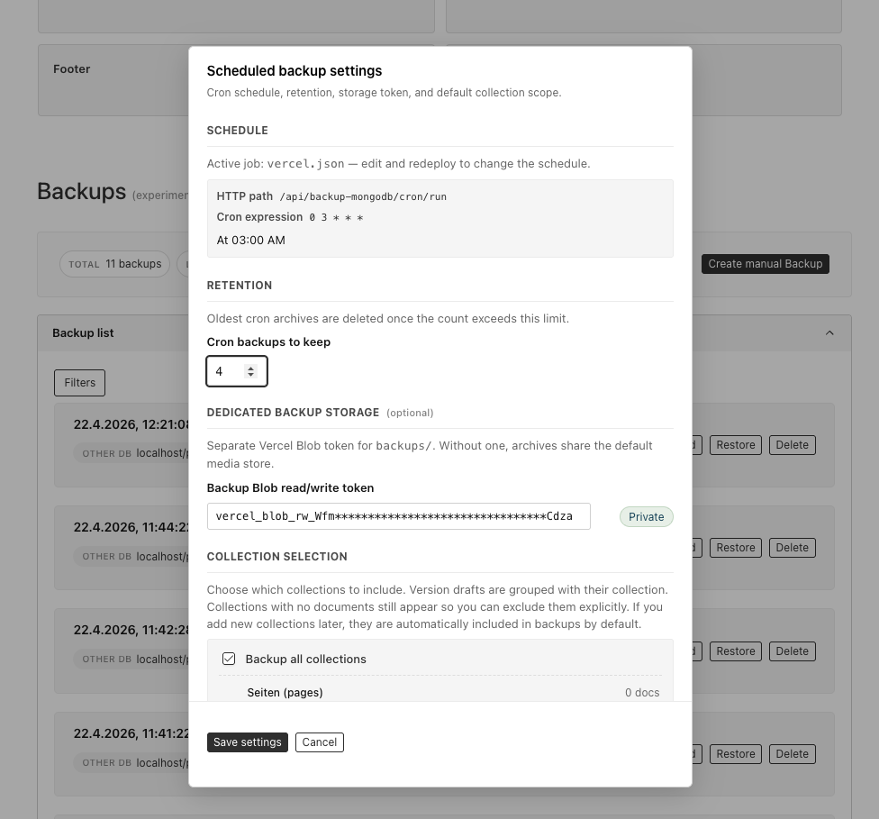

> Experimental. Originated in the [Payblocks](https://www.shadcnblocks.com/payload-cms) template, now maintained as a standalone package. Running in production at 20+ projects from TRWK agency. Feedback and PRs welcome.

# @trieb.work/payload-plugin-backup-mongodb

[](https://www.npmjs.com/package/@trieb.work/payload-plugin-backup-mongodb)

A **Payload CMS v3** plugin for **MongoDB only** — not Postgres, SQLite, or other database adapters. It handles Mongo + media backup, restore, and scheduled retention with zero meta-database and a built-in admin UI. Backups live directly in Vercel Blob Storage, so a fresh install can list and restore any prior backup without bootstrapping a database first.



A first-class **Backups** section lives right below the Payload dashboard: browse every archive
sorted by creation time, see at a glance which host and database it belongs to, whether media is
bundled and how big it is, then download, restore or delete any backup with one click. Read more on how it originated at [TRWK> Case Study](https://trwk.de/case-studies/payload-plugin-mongodb-backup-restore).

---

## Highlights

- **No meta database.** Every backup is self-describing in its blob name (`type---db---host---{collectionCount}-{timestampMs}.{ext}`). A brand new project can list and restore any backup straight from blob storage.
- **Scheduled (cron) and on-demand backups.** Wire `/api/backup-mongodb/cron/run` to Vercel Cron or any HTTP scheduler. Retention is configurable (N most recent cron backups are kept; older ones are pruned automatically).
- **Full database coverage.** Dumps **every** MongoDB collection via the Payload mongoose adapter — including hidden system collections like `users`, `payload-preferences`, `payload-migrations`. Individual collections can be excluded per backup from the UI or via API.
- **Optional media bundling.** Cron or manual backups can include Payload `media` blobs in a `.tar.gz` archive alongside the MongoDB dump.
- **Restore with filters.** Restore any backup with an optional collection blacklist and `mergeData` upsert mode. Partial restores keep the running admin session / tasks collection intact.
- **Native admin dashboard.** Adds a `BackupDashboard` widget to the Payload admin (`afterDashboard`): list / sort / filter / search backups, trigger manual backups or restores, configure retention and storage, and live-poll long-running tasks.
- **Payload REST, not Next.js route files.** All endpoints are registered as Payload custom endpoints and served by the default `/api/[...slug]` handler — you do not add `app/.../route.ts` files for this plugin.
- **Pluggable blob storage.** Uses `BLOB_READ_WRITE_TOKEN` by default (the same store you often use with `@payloadcms/storage-vercel-blob`), or point backups at a dedicated Vercel Blob store in the admin. Both **public** and **private** access stores are supported; a validation step detects which modes the store accepts.
- **Resumable long-running tasks.** Manual backups, restores, and seed runs are tracked in a hidden `backup-tasks` collection (TTL, 30 min). The UI polls progress with a short-lived `pollSecret` so long jobs stay observable even across reloads.
- **Demo/seed support.** Optional `seedDemoDumpUrl` registers a one-click seed endpoint for templates and starters.
- **Tested.** Vitest covers archive, backup, restore, task progress, blob I/O, endpoint auth, cron parsing, and blob-name helpers.

---

## Requirements

- Payload **v3+** (same major as your other `@payloadcms/*` packages).
- MongoDB with Payload’s mongoose adapter (`@payloadcms/db-mongodb`).
- MongoDB server (any version supported by that adapter).
- A Vercel Blob read/write token (`BLOB_READ_WRITE_TOKEN`). Vercel hosting is **not** required — any Node runtime that can reach Vercel Blob works.
- Next.js **15+** and React **19+** (the usual Payload 3 + App Router stack).

### Environment variables

| Variable                       | Required | Purpose                                                                                                                                                                                                                                                                                                                |
| ------------------------------ | -------- | ---------------------------------------------------------------------------------------------------------------------------------------------------------------------------------------------------------------------------------------------------------------------------------------------------------------------- |
| `MONGODB_URI`                  | yes      | MongoDB connection string (used by Payload and to label backups with the DB name).                                                                                                                                                                                                                                     |
| `BLOB_READ_WRITE_TOKEN`        | yes      | Default Vercel Blob store for backups and media. Can be overridden in admin settings.                                                                                                                                                                                                                                  |
| `CRON_SECRET`                  | for cron | Bearer token for every `/api/backup-mongodb/cron/*` call. Vercel Cron can supply this.                                                                                                                                                                                                                                 |
| `NEXT_PUBLIC_SERVER_URL`       | optional | Used to label backups with the current host. Falls back to `VERCEL_URL` when set.                                                                                                                                                                                                                                      |
| `BACKUPS_TO_KEEP`              | optional | Default retention for cron backups if the settings document has not been edited. Default `10`.                                                                                                                                                                                                                         |
| `PAYLOAD_BACKUP_ALLOWED_ROLES` | optional | Comma-separated role slugs that may see the **Backups** dashboard (case-insensitive). Use `*` to allow any authenticated user. When unset, the plugin falls back to requiring a `role` with slug `admin`, or allows everyone when the users collection has no `roles` field. Overridden by the `access` plugin option. |

---

## Installation and getting started

Use this flow when **adding the plugin to an existing Payload 3 + Next.js app** that already has MongoDB and (typically) Vercel Blob configured.

### 1. Add the package

```bash
pnpm add @trieb.work/payload-plugin-backup-mongodb
# npm install @trieb.work/payload-plugin-backup-mongodb
# yarn add @trieb.work/payload-plugin-backup-mongodb
```

Peer dependencies: **`@payloadcms/db-mongodb`**, **`payload`**, **`@payloadcms/ui`**, **`next`**, and **`react`**. (all expected in a Payload 3 + MongoDB + Next.js app).

### 2. Register the plugin

```ts
// payload.config.ts
import { buildConfig } from 'payload'
import { backupMongodbPlugin } from '@trieb.work/payload-plugin-backup-mongodb'

export default buildConfig({
  // your db adapter, collections, etc.
  plugins: [
    backupMongodbPlugin({
      // all options optional — see "Plugin options"
    }),
  ],
})
```

The plugin will register the backup collections, mount the dashboard, and add `/api/backup-mongodb/*` endpoints. Import paths resolve to a **published or linked** `dist/` build; after local changes to the package, run `pnpm build` in the plugin repo (or reinstall) so `dist/` is up to date.

### 3. Regenerate types and the import map

So Payload picks up the new admin components and collections:

```bash
pnpm payload generate:types
pnpm payload generate:importmap
```

### 4. (Optional) Schedule cron backups

**Vercel:** add a cron in `vercel.json`. Path must match your API; default is under `/api/…`:

```json
{
  "crons": [
    {
      "path": "/api/backup-mongodb/cron/run",
      "schedule": "0 3 * * *"
    }
  ]
}
```

Vercel Cron sends header `Authorization: Bearer $CRON_SECRET`. **Other hosts** (k8s, GitHub Actions, etc.): `GET` the same URL on your schedule with that same authorization header.

### Checklist

- [ ] Package installed
- [ ] `backupMongodbPlugin` in `plugins` array
- [ ] `generate:types` and `generate:importmap` run
- [ ] `MONGODB_URI` and `BLOB_READ_WRITE_TOKEN` set in the environment
- [ ] (Optional) `CRON_SECRET` and cron job (vercel.json) if you want scheduled backups

Start your dev server, open `/admin`, sign in as an admin, and you should see **Backups** below the dashboard.

---

## Admin UI

After the first login as an admin user, a **Backups** section appears below the default Payload
dashboard. Day-to-day tasks — create, download, restore, delete, schedule — all happen in the UI below.

**Who can see it?** The visibility rules, in precedence order:

1. If the plugin is registered with an `access` function, it wins (see [Plugin options](#plugin-options)).
2. Otherwise, if `PAYLOAD_BACKUP_ALLOWED_ROLES` is set, it is used as a comma-separated allow-list of role slugs (case-insensitive). Use `*` for "any authenticated user". Example: `PAYLOAD_BACKUP_ALLOWED_ROLES=admin,superadmin`.
3. Otherwise, the historical default applies: users with a `role` whose slug is `admin` see the dashboard; projects that don't use a `roles` field at all get the dashboard for any authenticated user.

### Scheduled (cron) vs on-demand (manual) backups

- **Scheduled / cron** backups follow shared settings: retention, media toggle, and collections to skip. Older cron archives are pruned when the keep-count is exceeded. They appear in the list as **CRON BACKUP** (or similar).
- **Manual / on-demand** backups are configured **per run** — per-collection toggles, optional media in a `.tar.gz` archive. Manual backups are not auto-pruned; use them as checkpoints before migrations.



### Selective restore with per-collection preview

**Restore** opens a preview of the archive before any write. You can restore everything, cherry-pick collections, or skip media from `.tar.gz` when you only need database rows. Restoring from a different host or database is supported; filters help when cloning production into staging.



### Scheduled backup settings

Retention, storage token, and cron collection skip list live in one modal:



- **Schedule:** when `vercel.json` is present, the plugin can show a human-readable cron description (via [cronstrue](https://github.com/bradymholt/cronstrue)).
- **Retention:** how many **cron** archives to keep; manual backups are not pruned by this.
- **Dedicated backup storage (optional):** a separate Vercel Blob read/write token so backups can live in a different store than media. The UI can validate the token and optionally copy existing `backups/*` objects to the new store.
- **Collection selection for cron:** defaults to all collections, with per-collection opt-out.

---

## Plugin options

```ts
type BackupPluginOptions = {
  /**
   * Set to `false` to disable the plugin (no collections, endpoints, or admin UI).
   * Omit or leave unset to keep the plugin active.
   */
  enabled?: boolean

  /** Default cron retention when no value is stored in settings. Falls back to `BACKUPS_TO_KEEP` or `10`. */
  backupsToKeep?: number

  /**
   * If set, registers `POST /api/backup-mongodb/admin/seed` (demo dump + public seed media where applicable).
   * Omit in production unless you need it.
   */
  seedDemoDumpUrl?: string

  /**
   * Custom access check for admin routes and the dashboard. Overrides the
   * `PAYLOAD_BACKUP_ALLOWED_ROLES` env var when provided.
   *
   * Default (env-based): see the `PAYLOAD_BACKUP_ALLOWED_ROLES` entry in the
   * environment variables table. When neither is configured, the check falls back
   * to a role with slug `admin`, or allows any authenticated user in projects
   * without a `roles` field.
   */
  access?: (user: Record<string, unknown> | null) => boolean
}
```

Example with custom access and seed URL (typical for starters):

```ts
backupMongodbPlugin({
  access: (user) =>
    Array.isArray((user as { roles?: { slug?: string }[] })?.roles) &&
    (user as { roles: { slug?: string }[] }).roles.some(
      (r) => r?.slug === 'admin' || r?.slug === 'superadmin',
    ),
  seedDemoDumpUrl: 'https://example.com/seed/demo-db.json',
})
```

---

## HTTP API (Payload REST)

All routes are served by Payload’s `/api/[...slug]` handler under **`/api/backup-mongodb/…`**. The `backup-mongodb` prefix avoids clashing with a collection slug. The admin UI uses the same URLs; use the exported `backupPluginPublicApiPaths` helper in client code.

### Cron / external (Bearer `CRON_SECRET`)

```http
GET  /api/backup-mongodb/cron/run        # enqueue a cron backup
GET  /api/backup-mongodb/cron/list     # list backups
POST /api/backup-mongodb/cron/restore  # body: { "url": "https://…" }
Authorization: Bearer <CRON_SECRET>
```

### Admin (session cookie, or `pollSecret` for `/task/:id` where applicable)

| Method         | Path                                                           |
| -------------- | -------------------------------------------------------------- |
| `POST`         | `/api/backup-mongodb/admin/manual`                             |
| `POST`         | `/api/backup-mongodb/admin/restore`                            |
| `POST`         | `/api/backup-mongodb/admin/backup-preview`                     |
| `POST`         | `/api/backup-mongodb/admin/restore-preview`                    |
| `POST`         | `/api/backup-mongodb/admin/delete`                             |
| `GET`          | `/api/backup-mongodb/admin/backup-download`                    |
| `GET`          | `/api/backup-mongodb/admin/task/:id`                           |
| `GET` / `POST` | `/api/backup-mongodb/admin/settings`                           |
| `POST`         | `/api/backup-mongodb/admin/validate-blob-token`                |
| `POST`         | `/api/backup-mongodb/admin/seed` — if `seedDemoDumpUrl` is set |

---

## Programmatic API

For scripts, hooks, and tests:

```ts
import { createBackup, listBackups, restoreBackup } from '@trieb.work/payload-plugin-backup-mongodb'

// Example: manual backup from a one-off script
await createBackup(payload, { cron: false, includeMedia: true })

// Example: restore from a URL, skipping `users`
await restoreBackup(payload, downloadUrl, ['users'], false)

// Example: list backup archives (token from backup-settings + env, same as create/restore)
const blobs = await listBackups(payload)
```

---

## Blob storage model

### Blob naming

```

backups/{type}---{dbName}---{hostname}---{collectionCount}-{timestampMs}.{json|tar.gz}

```

- `type`: `cron` or `manual` (and legacy-style labels where applicable).
- `dbName` / `hostname`: derived from your MongoDB URL and public server URL; URL-encoded in the name.
- `collectionCount` + `timestampMs`: sort key for listing; legacy blob names are still supported.

### Public vs private stores

A validation step probes the bucket and records whether the store behaves as public or private. New uploads use the right access mode. Restore and preview flows handle both.

### Overriding the backup store

To keep backups in a **different** Vercel Blob project than media, open **Backup settings** in the admin, paste a dedicated `BLOB_READ_WRITE_TOKEN`, validate, and optionally migrate existing `backups/*` objects to the new store before switching.

---

## Running the tests

```bash
pnpm test:int
```

### E2E (Playwright)

End-to-end tests live in `tests/e2e/` and target the `dev/` Next + Payload app. **Locally**, start Mongo (or rely on the in-memory replica set when `DATABASE_URL` / `MONGODB_URI` are unset), then either run `pnpm dev` and `pnpm test:e2e` in another shell (Playwright reuses the server when not in `CI`), or run only `pnpm test:e2e` so Playwright starts `pnpm dev` for you.

**CI** (`.github/workflows/e2e.yml`, same pattern as the reference `e2e.yml` in executive-search: MongoDB 7 service, `pnpm run build` then `pnpm run build:dev`, then Playwright against `next start`). Optional secret **`BLOB_READ_WRITE_TOKEN`** for fuller blob behaviour.

### Optional: deploy `dev/` to Vercel

`.github/workflows/deploy-dev-vercel.yml` runs when `dev/` (or related paths) change on `main`, or via **workflow_dispatch**, **only if** `VERCEL_TOKEN`, `VERCEL_ORG_ID`, and `VERCEL_PROJECT_ID` are set. Configure the Vercel project **Root Directory** to `dev` (`dev/vercel.json` wires install/build from the repo root).

The repo includes a `dev/` Payload + Next app (MongoDB Memory Server when no URI is set): `pnpm dev` → `http://localhost:3000/admin` (login in `dev/helpers/credentials.ts`). In unit tests, external services like `@vercel/blob` and `bson` are often mocked with `vi.mock()`.

---

## Publishing (npm)

Versioning uses [Changesets](https://github.com/changesets/changesets): add a file with `pnpm changeset`, open a PR to `main`, and merge. The **Release** workflow opens a “version packages” PR or runs `pnpm run release` (`build` + `changeset publish`) when the set of changesets is ready. PRs need a new `.changeset/*.md` unless you add the **`no-changeset`** label (e.g. docs-only).

---

## Roadmap / ideas

- Multipart / very large backup uploads (Vercel Blob supports large objects; may need to switch past single-part limits).
- Additional storage adapters (S3, R2, filesystem, etc.).
- Scheduler-agnostic display when not using Vercel (`vercel.json` is currently used for the schedule summary where available).
- Streaming restore for very large databases.
- Configurable `backups/` prefix or bucket layout.
- add support for tenant plugin and partial backups per tenant

---

## License

MIT

---

Built and maintained by [TRWK>](https://trwk.de), formerly [trieb.work](https://trieb.work).
